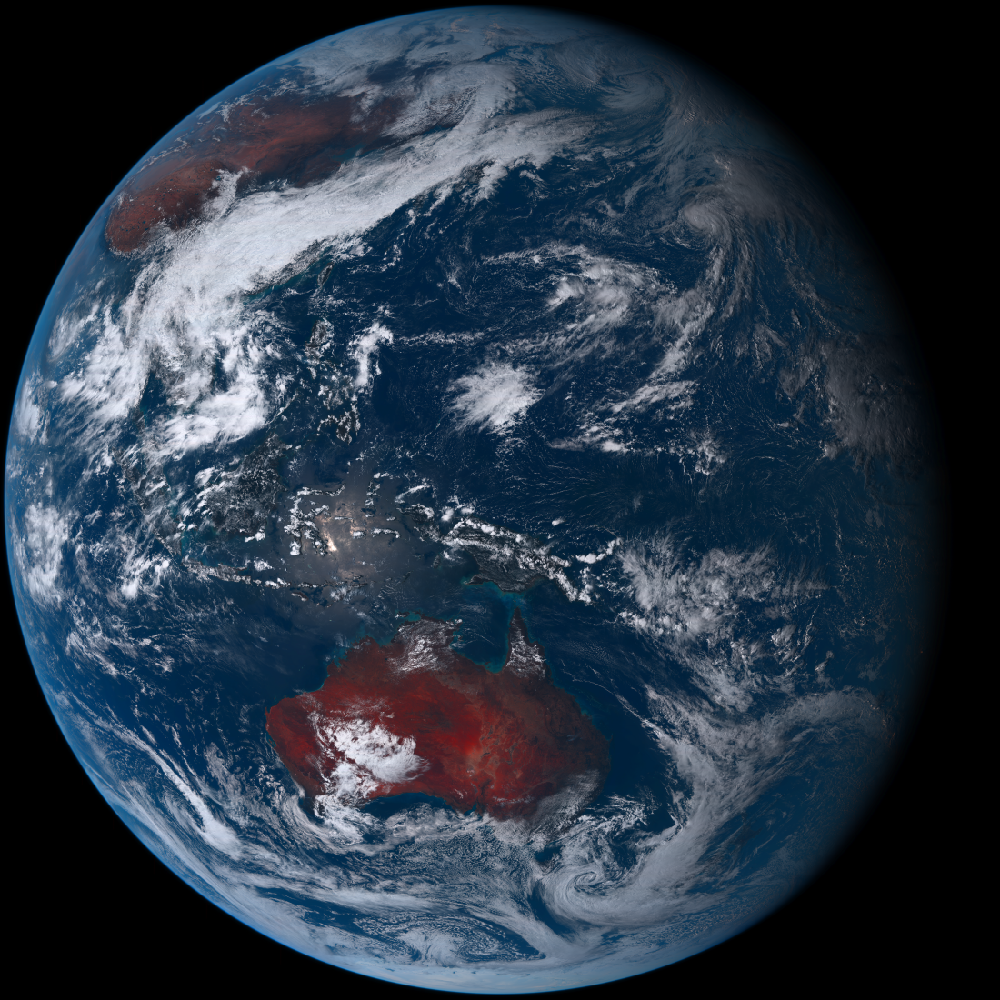

# himawari8-capturer

himawari8-capturer is a tool that can get picture of the earth taken by the himawari 8

## Install

Get the source code and build.

### How to get source code ?

You have 2 ways to get source code

1. Clone the repository
   ```shell
   $ git clone https://github.com/fissssssh/himawari8-capturer.git
   ```
2. [Download the source code](https://github.com/fissssssh/himawari8-capturer/archive/refs/heads/main.zip)

### How to build ?

```shell
$ cd himawari8-capturer
$ go build -o build/himawari8-capturer cmd/main.go
```

## Usage

```shell
$ ./himawari-capturer -q quality -t unix_millisecond_timestamp
```

### Example

```shell
$ ./build/himawari8-capturer -t 1634359675264
2021/10/16 23:01:19 Get 1-1 tile image from https://himawari8.nict.go.jp/img/D531106/2d/550/2021/10/16/044000_1_1.png...
2021/10/16 23:01:19 Get 0-1 tile image from https://himawari8.nict.go.jp/img/D531106/2d/550/2021/10/16/044000_0_1.png...
2021/10/16 23:01:19 Get 0-0 tile image from https://himawari8.nict.go.jp/img/D531106/2d/550/2021/10/16/044000_0_0.png...
2021/10/16 23:01:19 Get 1-0 tile image from https://himawari8.nict.go.jp/img/D531106/2d/550/2021/10/16/044000_1_0.png...
2021/10/16 23:01:23 Get 0-1 tile image done!
2021/10/16 23:01:23 Get 1-0 tile image done!
2021/10/16 23:01:23 Get 1-1 tile image done!
2021/10/16 23:01:23 Get 0-0 tile image done!
2021/10/16 23:01:23 Tile images were composed!
2021/10/16 23:01:23 Saving image to himawari8_20211016T044000Z.png
2021/10/16 23:01:24 All done!
```


